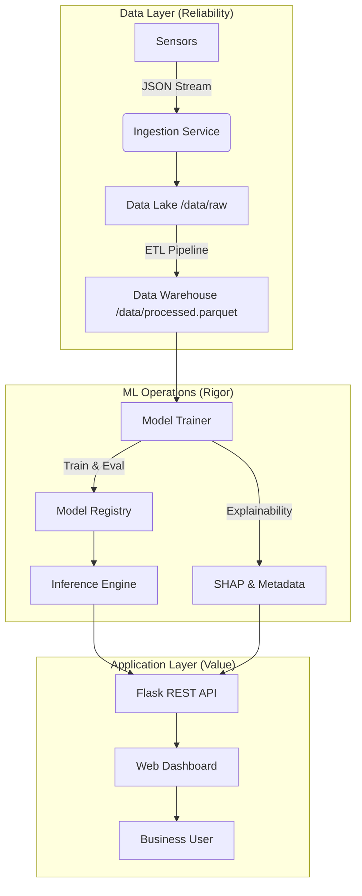

[🌐 Language: **English**](#english) | [**Tiếng Việt**](#tiếng-việt)

---

<a name="english"></a>
# Air Quality Intelligence Platform for Vietnam (Enterprise Edition)

**End-to-End Data Engineering, Machine Learning, and Decision Support System**


## 1️⃣ Executive Summary
This project is a **production-oriented Air Quality Intelligence Platform** designed to ingest, process, forecast, and visualize air pollution data (PM2.5, PM10, NO2, O3) for Vietnam. Unlike academic experiments, this system prioritizes **data pipeline reliability, model reproducibility, and decision accountability**. It demonstrates a full-stack engineering capability—from raw data ingestion to an actionable executive dashboard—built with the rigor required for enterprise deployment.

## 2️⃣ Problem Statement & Motivation
Air pollution is a critical public health issue in Vietnam, with PM2.5 levels frequently exceeding WHO safety guidelines. Traditional monitoring provides current data but lacks predictive capability and actionable context.
**The solution**: A centralized platform that not only forecasts future pollution levels but also explains *why* risks are escalating (e.g., separating traffic impact from weather seasonality), empowering stakeholders to take proactive measures.

## 3️⃣ System Overview
The platform operates as a cohesive system:
*   **Ingestion**: Captures sensor data (simulated for portfolio demonstration) into a raw Data Lake.
*   **Processing**: Cleans and transforms data using a robust, config-driven ETL pipeline.
*   **Forecasting**: Predicts 24-hour pollution trends using hybrid statistical (ARIMA) and deep learning (LSTM) models.
*   **Analysis**: Classifies health risk levels and identifies key pollution drivers using SHAP.
*   **Decision Support**: Delivers insights via a "Liquid Glass" interactive dashboard.

## 4️⃣ Architecture Overview


**Rationale**: The separation of "Data Lake" (Raw JSON) and "Data Warehouse" (Parquet) ensures raw data immutability while optimizing analytical query performance.

## 5️⃣ Data Engineering Pipeline
*   **Sources**: Architecture supports IoT sensor nodes (simulated distribution in Hanoi).
*   **ETL Design**: A configuration-driven pipeline (`src/processing/`) that handles:
    *   **Imputation**: KNN-based filling for temporal gaps.
    *   **Outlier Handling**: Inter-Quartile Range (IQR) capping to mitigate sensor noise.
*   **Storage**: PyArrow/Parquet for efficient columnar storage and schema validation.

## 6️⃣ Machine Learning & Analytics
We employ a tiered modeling strategy to balance baseline performance with advanced pattern recognition:
*   **Baseline (ARIMA)**: Statistical forecasting with **Augmented Dickey-Fuller (ADF)** tests to validate stationarity assumptions.
*   **Deep Learning (LSTM)**: A generic 2-layer LSTM network with **Early Stopping** to capture non-linear temporal dependencies (e.g., rush hour peaks).
*   **Evaluation**: Rigorous metrics (RMSE, MAE, MAPE) and Diebold-Mariano tests (concept) to validate model superiority.

## 7️⃣ Explainability & Trust
A key differentiator of this platform is **transparency**. We do not rely on "Black Box" predictions.
*   **SHAP (SHapley Additive exPlanations)**: Deconstructs the Random Forest risk classifier's decisions.
*   **Impact**: Users can see if a "Red Alert" is driven by NO2 (Likely Traffic) or PM2.5 (Likely regional haze/burning).
*   **Reproducibility**: All random seeds are fixed globally (`config.py`) to ensure training runs are deterministic.

## 8️⃣ API & Backend
A modular **Flask REST API** serves as the backbone:
*   **`/api/stats`**: Real-time forecast and risk status.
*   **`/api/history`**: Historical time-series data for analytics.
*   **Design**: RESTful principles, JSON responses, and cors-enabled for frontend flexibility.

## 9️⃣ Dashboard & Decision Support
The frontend is not just a visual layer but a decision support tool designed with a **macOS-inspired "Liquid Glass" aesthetic**.
*   **Overview**: Instant situational awareness (Risk Level, Trend).
*   **Analytics**: Historical deep-dives with interactive Plotly plotting.
*   **Storytelling**: Automated narrative insights (e.g., "Air quality is degrading due to rising PM2.5").

## 🔟 Production Readiness
*   **Config-Driven**: All thresholds, paths, and hyperparameters are centralized in `src/config.py`.
*   **Versioning**: Models are saved with metadata; the system gracefully handles missing model files.
*   **CI/CD Ready**: The modular structure supports easy containerization (Docker) and orchestration (Airflow).

## 1️⃣1️⃣ Limitations
*   **Data Source**: Currently uses a high-fidelity simulator (`DataGenerator`) rather than live hardware feeds.
*   **Scale**: The local Parquet implementation is optimal for single-node deployment (<10GB) but would require migration to S3/Delta Lake for petabyte scale.
*   **Health Disclaimer**: Risk levels are substantial but strictly informational; they do not constitute medical advice.

## 1️⃣2️⃣ Future Roadmap
*   **Streaming**: Upgrade ingestion to Apache Kafka for real-time event processing.
*   **Data Mesh**: Decentralize ownership if expanding to multiple cities/domains.
*   **Alerts**: Integrate Telegram/Email webhooks for active push notifications.

## 1️⃣3️⃣ Tech Stack
*   **Core**: Python 3.10+, Pandas, NumPy
*   **ML**: TensorFlow (Keras), Scikit-Learn, Statsmodels, SHAP
*   **Backend**: Flask, Joblib
*   **Frontend**: Tailwind CSS, Plotly.js, Alpine.js, Jinja2

## 1️⃣4️⃣ How to Run
```bash
# 1. Setup Environment
python3 -m venv venv
source venv/bin/activate
pip install -r requirements.txt

# 2. Run Pipeline (Ingest -> Clean -> Train)
python3 main.py

# 3. Start Dashboard
python3 src/serving/api.py
# Access at http://localhost:5000
```

## 1️⃣5️⃣ Why This Project Matters
This project demonstrates **Senior Engineering Competency** by moving beyond simple model fitting. It showcases:
*   **System Design**: Architecting for reliability and maintainability.
*   **Business Value**: Translating technical metrics (RMSE) into business insights (Risk Alerts).
*   **Full-Stack Ownership**: Delivering a polished, user-facing product from scratch.

---

<br>

<a name="tiếng-việt"></a>
# Nền tảng Trí tuệ Nhân tạo Dự báo Chất lượng Không khí (Phiên bản Doanh nghiệp)

**Hệ thống Kỹ thuật Dữ liệu, Máy học và Hỗ trợ Ra quyết định Toàn diện**

## 1️⃣ Tóm tắt Điều hành
Dự án này là một **Nền tảng Tình báo Chất lượng Không khí** chuẩn sản xuất (production-oriented), được thiết kế để thu thập, xử lý, dự báo và trực quan hóa dữ liệu ô nhiễm không khí (PM2.5, PM10, NO2, O3) tại Việt Nam. Khác với các mô hình thử nghiệm học thuật, hệ thống này ưu tiên **độ tin cậy của luồng dữ liệu (data pipeline), tính tái lập của mô hình (reproducibility) và trách nhiệm giải trình**. Đây là minh chứng cho năng lực kỹ thuật toàn diện (full-stack)—từ xử lý dữ liệu thô đến bảng điều khiển quản trị—được xây dựng với sự chặt chẽ cần thiết cho môi trường doanh nghiệp.

## 2️⃣ Vấn đề & Động lực
Ô nhiễm không khí là vấn đề sức khỏe cộng đồng cấp bách tại Việt Nam. Các trạm quan trắc truyền thống chỉ cung cấp dữ liệu hiện tại mà thiếu khả năng dự báo và bối cảnh hành động.
**Giải pháp**: Một nền tảng tập trung không chỉ dự báo mức độ ô nhiễm trong tương lai mà còn giải thích *tại sao* rủi ro lại gia tăng (ví dụ: tách biệt tác động của giao thông và thời tiết), giúp người ra quyết định có những hành động chủ động.

## 3️⃣ Tổng quan Hệ thống
Nền tảng hoạt động như một hệ thống nhất quán:
*   **Thu thập (Ingestion)**: Ghi nhận dữ liệu cảm biến vào Data Lake (dữ liệu thô).
*   **Xử lý (Processing)**: Làm sạch và chuyển đổi dữ liệu bằng quy trình ETL cấu hình hóa.
*   **Dự báo (Forecasting)**: Dự đoán xu hướng ô nhiễm 24 giờ tới sử dụng mô hình lai giữa thống kê (ARIMA) và học sâu (LSTM).
*   **Phân tích (Analysis)**: Phân loại mức độ rủi ro sức khỏe và xác định các nguyên nhân chính bằng SHAP.
*   **Hỗ trợ Quyết định**: Cung cấp thông tin chi tiết qua bảng điều khiển tương tác "Liquid Glass".

## 4️⃣ Kiến trúc Tổng quan

*(Vui lòng tham khảo biểu đồ Mermaid ở phần tiếng Anh)*

**Lý giải thiết kế**: Việc phân tách "Data Lake" (JSON thô) và "Data Warehouse" (Parquet) đảm bảo tính bất biến của dữ liệu gốc trong khi tối ưu hóa hiệu suất truy vấn phân tích.

## 5️⃣ Quy trình Kỹ thuật Dữ liệu (Data Engineering)
*   **Nguồn dữ liệu**: Hỗ trợ các nút cảm biến IoT (mô phỏng phân bố tại Hà Nội).
*   **Thiết kế ETL**: Quy trình dựa trên cấu hình (`src/processing/`) xử lý:
    *   **Gán dữ liệu (Imputation)**: Sử dụng KNN để điền các khoảng trống thời gian.
    *   **Xử lý ngoại lai**: Cắt lọc theo khoảng tứ phân vị (IQR) để giảm nhiễu cảm biến.
*   **Lưu trữ**: PyArrow/Parquet tối ưu hóa lưu trữ cột và kiểm thực lược đồ.

## 6️⃣ Máy học & Phân tích
Chúng tôi áp dụng chiến lược đa tầng để cân bằng hiệu suất cơ bản và khả năng nhận diện mẫu nâng cao:
*   **Cơ sở (ARIMA)**: Dự báo thống kê với kiểm định **Augmented Dickey-Fuller (ADF)** để xác nhận giả định tính dừng của chuỗi số liệu.
*   **Học sâu (LSTM)**: Mạng LSTM 2 lớp với kỹ thuật **Early Stopping** để nắm bắt các phụ thuộc thời gian phi tuyến tính.
*   **Đánh giá**: Sử dụng các chỉ số chặt chẽ (RMSE, MAE, MAPE) để kiểm chứng độ chính xác của mô hình.

## 7️⃣ Khả năng Giải thích & Độ tin cậy
Điểm khác biệt chính của nền tảng này là **tính minh bạch**. Chúng tôi không dựa vào các dự đoán "Hộp đen".
*   **SHAP (SHapley Additive exPlanations)**: Giải thích các quyết định phân loại rủi ro của Random Forest.
*   **Tác động**: Người dùng có thể thấy liệu "Cảnh báo Đỏ" là do NO2 (Có thể do giao thông) hay PM2.5 (Có thể do mù khô/đốt rơm rạ).
*   **Tính tái lập**: Tất cả các seed ngẫu nhiên được cố định toàn cục (`config.py`) để đảm bảo kết quả huấn luyện là nhất quán.

## 8️⃣ API & Backend
**Flask REST API** dạng mô-đun đóng vai trò xương sống:
*   **`/api/stats`**: Trạng thái rủi ro và dự báo thời gian thực.
*   **`/api/history`**: Dữ liệu chuỗi thời gian lịch sử phục vụ phân tích.
*   **Thiết kế**: Tuân thủ nguyên tắc RESTful, phản hồi JSON, hỗ trợ CORS.

## 9️⃣ Bảng Điều khiển & Hỗ trợ Quyết định
Giao diện frontend không chỉ là lớp hiển thị mà là công cụ hỗ trợ ra quyết định với **thẩm mỹ "Liquid Glass" lấy cảm hứng từ macOS**.
*   **Tổng quan**: Nhận thức tình huống tức thì (Mức độ rủi ro, Xu hướng).
*   **Phân tích**: Đào sâu dữ liệu lịch sử với biểu đồ tương tác Plotly.
*   **Kể chuyện dữ liệu**: Thông tin chi tiết được tường thuật tự động (ví dụ: "Chất lượng không khí đang suy giảm do PM2.5 tăng cao").

## 🔟 Tính Sẵn sàng cho Sản xuất
*   **Hướng cấu hình**: Mọi ngưỡng, đường dẫn và siêu tham số đều tập trung tại `src/config.py`.
*   **Quản lý phiên bản**: Mô hình được lưu cùng siêu dữ liệu (metadata); hệ thống xử lý ngoại lệ khi thiếu file mô hình.
*   **Sẵn sàng cho CI/CD**: Cấu trúc mô-đun hỗ trợ đóng gói Container (Docker) và điều phối (Airflow) dễ dàng.

## 1️⃣1️⃣ Giới hạn
*   **Nguồn dữ liệu**: Hiện sử dụng trình mô phỏng độ chính xác cao (`DataGenerator`) thay vì nguồn cấp phần cứng trực tiếp.
*   **Quy mô**: Triển khai Parquet cục bộ là tối ưu cho hệ thống đơn lẻ (<10GB) nhưng cần di chuyển sang S3/Delta Lake cho quy mô Petabyte.
*   **Khuyến cáo sức khỏe**: Các mức độ rủi ro mang tính thông tin, không thay thế tư vấn y tế.

## 1️⃣2️⃣ Lộ trình Tương lai
*   **Sluồng (Streaming)**: Nâng cấp thu thập dữ liệu sang Apache Kafka để xử lý sự kiện thời gian thực.
*   **Data Mesh**: Phân cấp quyền sở hữu dữ liệu khi mở rộng sang nhiều thành phố/lĩnh vực.
*   **Cảnh báo**: Tích hợp webhook Telegram/Email để thông báo đẩy chủ động.

## 1️⃣3️⃣ Công nghệ Sử dụng
*   **Cốt lõi**: Python 3.10+, Pandas, NumPy
*   **ML**: TensorFlow (Keras), Scikit-Learn, Statsmodels, SHAP
*   **Backend**: Flask, Joblib
*   **Frontend**: Tailwind CSS, Plotly.js, Alpine.js, Jinja2

## 1️⃣4️⃣ Hướng dẫn Chạy
```bash
# 1. Thiết lập Môi trường
python3 -m venv venv
source venv/bin/activate
pip install -r requirements.txt

# 2. Chạy Quy trình (Thu thập -> Làm sạch -> Huấn luyện)
python3 main.py

# 3. Khởi chạy Bảng điều khiển
python3 src/serving/api.py
# Truy cập tại http://localhost:5000
```

## 1️⃣5️⃣ Ý nghĩa Dự án
Dự án này thể hiện **Năng lực Kỹ sư Cấp cao (Senior)** bằng cách vượt qua việc khớp mô hình đơn giản. Nó minh chứng:
*   **Thiết kế Hệ thống**: Kiến trúc hướng tới độ tin cậy và khả năng bảo trì.
*   **Giá trị Doanh nghiệp**: Chuyển đổi các chỉ số kỹ thuật (RMSE) thành thông tin kinh doanh (Cảnh báo Rủi ro).
*   **Làm chủ Toàn diện**: Bàn giao một sản phẩm hoàn thiện, hướng tới người dùng từ con số không.
